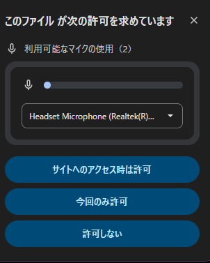

# Vibe-Explosion
## 概要
AI（M365 Copilot）との対話を中心とした vibe coding を実践し、音に反応してビジュアルが変化する
インタラクティブなデモアプリを作成しました。
これは Web ブラウザ上で動作するもので、マイク入力から取得した音量に応じて、背景、円形波形、
中心オブジェクト、パーティクルが連動して変化する視覚表現を実現しています。

## 構成

Vibe-Explosion/
├─ index.html
├─ script.js
├─ README.md
└─ images/
   └─ mic-permission.png

index.html の役割
この HTML ファイルは「音に反応するビジュアルエフェクト」を表示するためのシンプルなページです。
Web ブラウザで読み込み、 Canvas 要素をブラウザ画面全体に表示し、script.js を読み込んで描画を実行します。

script.js の役割
このJavaScriptファイルは、マイク音入力を受け取って、リアルタイムで HTML の Canvas 要素に
音で反応したビジュアルを描画するメインエンジン です。

マイク → 音声分析 → 音量計算 → Canvas描画 という流れを実現しています
「静止画」ではなく「毎フレーム動的に更新される映像」を作ります。
4つのビジュアル要素（背景、波形、爆発円、パーティクル）を組み合わせて描画を完成させています。

## 実行について
任意のブラウザで index.html を読み込みます。

### 実行時の注意点（マイクの使用について）

本デモは Web Audio API を使用しており、  
ブラウザからマイクへのアクセス許可が必要です。

初回アクセス時に以下のポップアップが表示されるため、  
「サイトへのアクセスは許可」を選択してください。

## 改訂履歴

v0.1 初版
v0.2 概要追加
v1.0 説明追加(構成、実行について等)